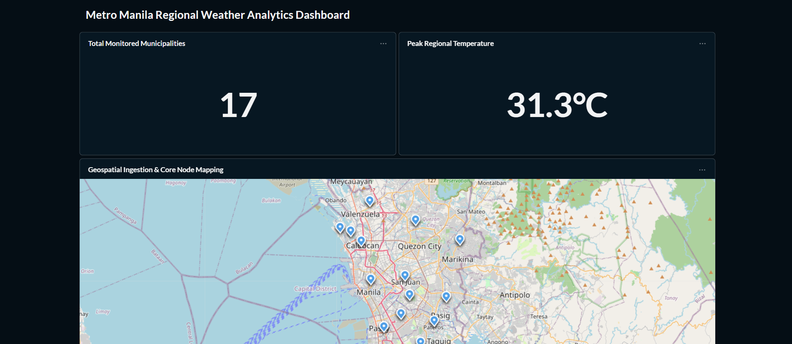
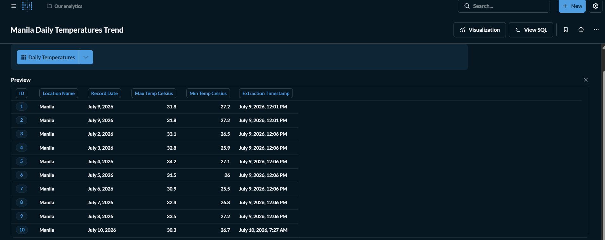

# 🌤️ Automated Weather ETL Pipeline

An end-to-end, containerized data pipeline that extracts live weather data, transforms it via Apache Airflow, and loads it into a PostgreSQL data warehouse for visualization in Metabase.

## 🏗️ Project Architecture

* **Extract:** Python hits the Open-Meteo REST API to fetch daily temperature data for Manila.
* **Transform:** Python parses the nested JSON payload and isolates the required metrics (Max/Min Celsius, Dates).
* **Load:** The cleaned data is loaded into a strictly typed PostgreSQL database.
* **Orchestrate:** Apache Airflow schedules and monitors the ETL process to run automatically on a daily schedule.
* **Visualize:** Metabase connects directly to the warehouse to serve a live, auto-updating dashboard.

## 💻 Tech Stack

* **Language:** Python 3
* **Orchestration:** Apache Airflow
* **Database:** PostgreSQL
* **Containerization:** Docker & Docker Compose
* **Business Intelligence:** Metabase

## 🚀 How to Run This Project Locally

**1. Clone the repository**
```bash
git clone [https://github.com/ylamik/weather-etl-pipeline.git](https://github.com/ylamik/weather-etl-pipeline.git)
cd weather-etl-pipeline


**2. Set up your environment variables**
Create a `.env` file in the root directory and add your database credentials:
```env
DB_USER=data_engineer
DB_PASSWORD=your_password
DB_NAME=data_engineer


**3. Spin up the containers**

docker-compose up -d --build


**4. Access the UI**

Airflow: http://localhost:8080

Metabase: http://localhost:3000

## 📊 Dashboard Snapshot


